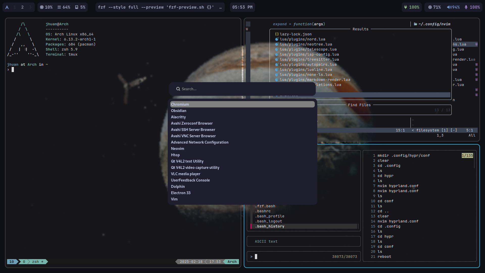

# Dotfiles

* Lista de configurações
   * Waybar | ~/.config
   * Hyprland | ~/.config
   * Wofi | ~/.config
   * Zsh | ~
   * Tmux | ~ (.tmux, .tmux.conf)
   * Neofetch | ~/.config
   * Neovim | ~/.config (ainda incompleto)



# [Nord Theme](https://www.nordtheme.com/)

### Zsh:

Instale o [Oh my zsh](https://github.com/ohmyzsh/ohmyzsh) usando:

```
sh -c "$(curl -fsSL https://raw.githubusercontent.com/ohmyzsh/ohmyzsh/master/tools/install.sh)"
```

Nord:

```
git clone https://github.com/fxbrit/nord-extended $ZSH/themes/nord-extended
```

### [Tmux](https://github.com/tmux/tmux/wiki):
```
git clone https://github.com/nordtheme/tmux ~/.tmux/themes/nord-tmux
```

# Wallpaper:

Copie o wallpaper.png para ~/Pictures/wallpaper.png

Se quiser usar outro wallpaper altere o caminho em `~/.config/hypr/hyprpaper.conf` (Altere o caminho nas duas linhas)

# Apps:

- Fzf (para procurar arquivos)
- Zoxide (alternativa ao cd)
- Exa (alternativa ao ls)
